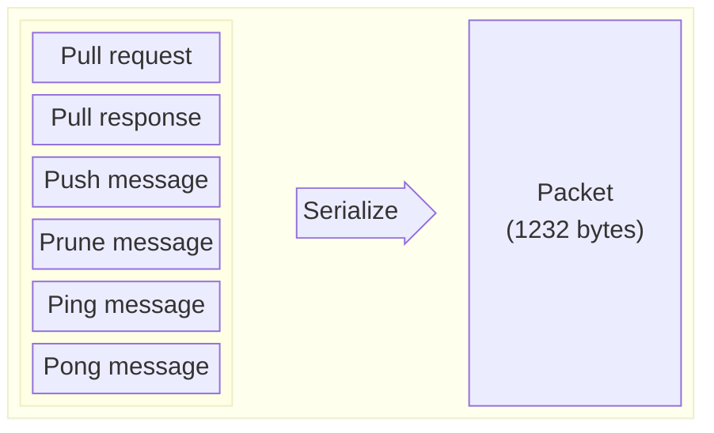

# Gossip protocol

Solana nodes communicate with each other and share data using the gossip protocol. Messages are exchanged in a binary format and need to be deserialized. There are six types of messages:
* pull request
* pull response
* push message
* prune message
* ping
* pong

Each message contains data specific to its type, such as shared values, filters, pruned nodes, etc. Nodes keep their data in _Cluster Replicated Data Store_ (`crds`), which is synchronized between nodes via pull requests, push messages and pull responses.

> [!Tip]
> **Naming conventions used in this document**
> - _Node_ - a validator running the gossip
> - _Peer_ - a node sending or receiving messages from the current node we are talking about
> - _Entrypoint_ - the gossip address of the peer the node will initially connect to
> - _Origin_ - node, the original creator of the message
> - _Cluster_ - a network of validators with a leader that produces blocks
> - _Leader_ - node, the leader of the cluster in a given slot
> - _Shred_ - the smallest portion of block produced by a leader
> - _Shred version_ - a cluster identification value
> - _Fork_ - a fork occures when two different blocks are chained to the same parent block (e.g. next block is created before the previous one was completed)
> - _Epoch_ - a predefined period composed of a specific number of blocks (_slots_) in which the validator schedule is defined
> - _Slot_ - the period of time for which each leader ingests transactions and produces a block
> - _Message_ - the protocol message a node sends to its peers, can be push message, pull request, prune message, etc.


## Message format

Each message is sent in a binary form with a maximum size of 1232 bytes (1280 is a minimum `IPv6 TPU`, 40 bytes is the size of `IPv6` header and 8 bytes is the size of the fragment header). 

Data sent in each message is serialized from a `Protocol` type, which can be one of:

| Enum ID  | Message                        | Data                          | Description |
|:--------:|--------------------------------|-------------------------------|-------------|
| 0 | [pull request](#pull-request)   | `CrdsFilter`, `CrdsValue` | sent by node to ask for new information |
| 1 | [pull response](#pull-response) | `SenderPubkey`, `CrdsValuesList` | response to a pull request |
| 2 | [push message](#push-message)   | `SenderPubkey`, `CrdsValuesList` | sent by node to share the latest data with the cluster |
| 3 | [prune message](#prune-message) | `SenderPubkey`, `PruneData` | sent to peers with a list of origin nodes that should be pruned |
| 4 | [ping message](#ping-message)   | `Ping` | sent by node to check for peers' liveliness |
| 5 | [pong message](#pong-message)   | `Pong` | response to a ping (confirm liveliness) |




<details>
  <summary>Solana client Rust implementation</summary>

``` rust
enum Protocol {
    PullRequest(CrdsFilter, CrdsValue),
    PullResponse(Pubkey, Vec<CrdsValue>),
    PushMessage(Pubkey, Vec<CrdsValue>),
    PruneMessage(Pubkey, PruneData),
    PingMessage(Ping),
    PongMessage(Pong)
}
```

</details>

### Type definitions
Fields described in the tables below have their types specified using Rust notation:
* `u8` - 8-bit unsigned integer
* `u16` - 16-bit unsigned integer
* `u32` - 32-bit unsigned integer, and so on...
* `[u8]` - dynamic size array of 1-byte elements
* `[u8; 32]` - fixed size array of 32 elements, with each element being 1 byte
* `[[u8; 64]]` - a two-dimensional array containing arrays of 64 1-byte elements 
* `b[u8]` - a bit vector containing 1-byte elements
* `u32 | None` - an option type, meaning an element is either `u32` (in this case) or `None`
* `(u32, [u8, 16])` - a tuple that contains two elements - one is a 32-bit integer, the second one is a 16-element array of bytes
* `MyStruct` - a complex type (either defined as a struct or a Rust enum), consisting of 
many elements of different basic types

The **Size** column in the tables below contains the size of data in bytes. The size of dynamic arrays contains an additional _plus_ (`+`) sign, e.g. `32+`, which means the array has at least 32 bytes. Empty dynamic arrays always have 8 bytes which is the size of the array header containing array length. 
In case the size of a particular complex data is unknown it is marked with `?`. The limit, however, is always 1232 bytes for the whole data packet (payload within the UDP packet).

#### Data serialization
In the Rust implementation of the Solana node, the data is serialized into a binary form using the [`bincode` crate][bincode] as follows:
* basic types, e.g. `u8`, `u16`, `u64`, etc. - are serialized as they are present in the memory, e.g. `u8` type is serialized as 1 byte, `u16` as 2 bytes, and so on,
* array elements are serialized as above, e.g. `[u8; 32]` array is serialized as 32 bytes, `[u16; 32]` will be serialized as 32 16-bit elements which are equal to 64 bytes,
* dynamically sized arrays always include an 8-byte header that specifies the array length, followed by the data bytes. Therefore, an empty array occupies 8 bytes,
* bit vectors are serialized similar to dynamic arrays - their header contains 1-byte which tells whether there is any data in the vector, followed by an 8-byte array length and the data,
* [enum types](#enum-types) contain a header with a 4-byte discriminant (tells which enum variant is selected) + additional data,
* option types are serialized using a 1-byte discriminant followed by the bytes of data. If a value is `None` discriminant is set to 0 and the data part is empty, otherwise it is set to 1 with data serialized according to its type,
* struct fields are serialized one by one using the rules above,
* tuples are serialized like structs.

##### Enum types
Enum types in Rust are more advanced than in other languages. Apart from _classic_ enum types, e.g.:
```rust
enum CompressionType {
    Gzip,
    Bzip2
}
```
it is also possible to create an enum which contains data fields, e.g.:
```rust
enum SomeEnum {
    Variant1(u64),
    Variant2(SomeType)
}

struct SomeType {
    x: u32,
    y: u16,
}
```
In the first case, the serialized object of the `CompressionType` enum will only contain a 4-byte header with the discriminant value set to the selected variant (`0 = GZip`, `1 = Bzip2`). In the latter case, apart from the header, the serialized data will contain additional bytes according to which variant was selected: 
* `Variant1`: 8 bytes
* `Variant2`: 6 bytes (the sum of `x` and `y` fields of `SomeType` struct)

When deserializing enums, it's important to handle them carefully because the amount of data that follows depends on the specific variant chosen.

### Push message
Nodes send push messages to share information with others. They periodically collect data from their `crds` and transmit push messages to their peers.

A node receiving a set of push messages will:

* check whether the sending node has replied to a recent [`ping` message](#ping-message)
* check for duplicate `CrdsValue`s and drop them
* insert new `CrdsValue`s into the `crds`
* transmit newly inserted `CrdsValue`s to their peers via push message.


| Data | Type | Size | Description |
|------|:----:|:----:|-------------|
| `SenderPubkey` | `[u8; 32]` | 32 | a pubkey belonging to the sender of the push message |
| `CrdsValuesList` | [`[CrdsValue]`](#data-shared-between-nodes) | 8+ | a list of Crds values to share  |

<details>
  <summary>Solana client Rust implementation</summary>

```rust
enum Protocol {
    //...
    PushMessage(Pubkey, Vec<CrdsValue>),
    //...
}
```
</details>

The node shouldn't process contact infos belonging to an unstaked node that hasn't yet replied to a recent [ping message](#ping-message).

### Pull request
A node sends a pull request to ask the cluster for new information. It creates a set of bloom filters populated with the hashes of the `CrdsValue`s in its `crds` table and sends different bloom filters to different peers. The recipients of the pull request use the received bloom filter to identify what information the sender is missing and then construct a [pull response](#pull-response) packed with the missing `CrdsValue` data for the origin of the pull request.

| Data | Type | Size | Description |
|------|:----:|:----:|-------------|
| `CrdsFilter` | [`CrdsFilter`](#crdsfilter) | 37+ | a bloom filter representing `CrdsValue`s the node already has |
| `ContactInfo` | [`CrdsValue`](#data-shared-between-nodes) | ? | The `crds` value containing contact info of the node that sent the pull request |

The required values for the `CrdsValue` is a [`ContactInfo`](#contactinfo) or a deprecated [`LegacyContactInfo`](#legacycontactinfo-deprecated) of the node that sent the pull request. The recommended usage for this contact info is the following:
 - Use it to check that the node is not sending a pull request to itself.
 - Check whether the sender node responded to a `Ping` message. If the node still hasn't replied to Ping message, generate a `Ping` message for the sender node, unless the recipient node is already awaiting for the `Ping` response.

The node shouldn't respond with a pull response message to node that hasn't yet replied to a recent [ping message](#ping-message).

#### CrdsFilter

| Data | Type | Size | Description |
|------|:----:|:----:|-------------|
| `filter` | [`Bloom`](#bloom) | 25+ | a bloom filter |
| `mask` | `u64` | 8 | filter mask which defines the data stored in the bloom filter |
| `mask_bits` | `u32` | 4 | number of mask bits, also defines a number of bloom filters as `2^mask_bits` |

#### Bloom
| Data | Type | Size | Description |
|------|:----:|:----:|-------------|
| `keys` | `[u64]` | 8+ | keys |
| `bits` | `b[u64]` | 9+ | bits |
| `num_bits` | `u64` | 8 | number of bits |

<details>
  <summary>Solana client Rust implementation</summary>

``` rust

enum Protocol {
    PullRequest(CrdsFilter, CrdsValue),
    //...
}

struct CrdsFilter {
    filter: Bloom,
    mask: u64,
    mask_bits: u32,
}

struct Bloom {
    keys: Vec<u64>,
    bits: BitVec<u64>,
    num_bits_set: u64,
}
```

</details>

### Pull response
These messages are sent in response to a [pull request](#pull-request). They contain values from the node's `crds` table that the origin of the pull request is missing, as determined by the bloom filters received in the pull request.

| Data | Type | Size | Description |
|------|:----:|:----:|-------------|
| `SenderPubkey` | `[u8; 32]` | 32 | a pubkey belonging to the sender of the pull response message |
| `CrdsValuesList` | [`[CrdsValue]`](#data-shared-between-nodes) | 8+ | a list of new values  |

<details>
  <summary>Solana client Rust implementation</summary>

```rust
enum Protocol {
    //...
    PullResponse(Pubkey, Vec<CrdsValue>),
    //...
}
```

</details>


### Prune message
Sent to peers with a list of origin nodes that should be pruned. No more push messages from pruned origin nodes should be sent by the recipient of this prune message to its sender.

| Data | Type | Size | Description |
|------|:----:|:----:|-------------|
| `SenderPubkey` | `[u8, 32]` | 32 | a pubkey belonging to the sender of the prune message |
| `PruneData` | [`PruneData`](#prunedata) | 144+ | a structure which contains prune details |


#### PruneData
| Data | Type | Size | Description |
|------|:----:|:----:|-------------|
| `pubkey` |`[u8, 32]` | 32 | public key of the origin of this message |
| `prunes` | `[[u8, 32]]` | 8+ | public keys of origin nodes that should be pruned |
| `signature` | `[u8, 64]` | 64 | signature of this message |
| `destination` | `[u8, 32]` | 32 | a public key of the destination node for this message |
| `wallclock` | `u64` | 8 | wallclock of the node that generated the message |

<details>
  <summary>Solana client Rust implementation</summary>

```rust
enum Protocol {
    //...
    PruneMessage(Pubkey, PruneData),
    //...
}

struct PruneData {
    pubkey: Pubkey,
    prunes: Vec<Pubkey,
    signature: Signature,
    destination: Pubkey,
    wallclock: u64,
}
```

</details>

**Note**: for signing purposes, before serializing, the `PruneData` struct is prefixed with the byte array `[0xff, 'S', 'O', 'L', 'A', 'N', 'A', '_', 'P', 'R', 'U', 'N', 'E', '_', 'D', 'A', 'T', 'A']`.

<details>
  <summary>Solana client Rust implementation</summary>

```rust
#[derive(Serialize)]
struct SignDataWithPrefix<'a> {
    prefix: &'a [u8], // Should be a b"\xffSOLANA_PRUNE_DATA"
    pubkey: &'a Pubkey,
    prunes: &'a [Pubkey],
    destination: &'a Pubkey,
    wallclock: u64,
}
```

</details>


### Ping message
Nodes send ping messages frequently to their peers to check whether they are active. The node receiving the ping message should respond with a [pong message](#pong-message).

| Data | Type | Size | Description |
|------|:----:|:----:|-------------|
| `from` |`[u8, 32]` | 32 | public key of the origin |
| `token` |`[u8, 32]` | 32 | 32 bytes token |
| `signature` |`[u8, 64]` | 64 | signature of the message |

<details>
  <summary>Solana client Rust implementation</summary>

```rust
enum Protocol {
    //...
    PingMessage(Ping),
    //...
}

struct Ping {
    from: Pubkey,
    token: [u8, 32],
    signature: Signature,
}
```

</details>


### Pong message
Sent by node as a response to the [ping message](#ping-message).

| Data | Type | Size | Description |
|------|:----:|:----:|-------------|
| `from` |`[u8, 32]` | 32 | public key of the origin |
| `hash` |`[u8, 32]` | 32 | hash of the received ping token prefixed by the "SOLANA_PING_PONG" string |
| `signature` |`[u8, 64]` | 64 | signature of the message |

<details>
  <summary>Solana client Rust implementation</summary>

```rust
enum Protocol {
    //...
    PongMessage(Pong)
}

struct Pong {
    from: Pubkey,
    hash: Hash,
    signature: Signature,
}
```

</details>

## Data shared between nodes

The `CrdsValue` values that are sent in push messages, pull requests, and pull responses contain the shared data and the signature of the data.

| Data | Type | Size | Description |
|------|:----:|:----:|-------------|
| `signature` | `[u8; 64]` | 64 | signature of the origin node that created the `CrdsValue`  |
| `data` | [`CrdsData`](#crdsdata) | ? | data  |

<details>
  <summary>Solana client Rust implementation</summary>

```rust
struct CrdsValue {
    signature: Signature,
    data: CrdsData,
}
```
</details>

### CrdsData
The `CrdsData` is an enum and can be one of:
| Enum ID | Type |
|:-------:|------|
| 0 | [LegacyContactInfo](#legacycontactinfo-deprecated) (_deprecated_)  |
| 1 | [Vote](#vote) |
| 2 | [LowestSlot](#lowestslot) |
| 3 | [LegacySnapshotHashes](#legacysnapshothashes-accountshashes-deprecated) (_deprecated_) |
| 4 | [AccountsHashes](#legacysnapshothashes-accountshashes-deprecated) (_deprecated_) |
| 5 | [EpochSlots](#epochslots) |
| 6 | [LegacyVersion](#legacyversion-deprecated) (_deprecated_) |
| 7 | [Version](#version-deprecated) (_deprecated_)  |
| 8 | [NodeInstance](#nodeinstance) (_almost deprecated_) |
| 9 | [DuplicateShred](#duplicateshred) |
| 10 | [SnapshotHashes](#snapshothashes) |
| 11 | [ContactInfo](#contactinfo) |
| 12 | [RestartLastVotedForkSlots](#restartlastvotedforkslots) |
| 13 | [RestartHeaviestFork](#restartheaviestfork) |

<details>
  <summary>Solana client Rust implementation</summary>

```rust
enum CrdsData {
    LegacyContactInfo(LegacyContactInfo),
    Vote(VoteIndex, Vote),
    LowestSlot(LowestSlotIndex, LowestSlot),
    LegacySnapshotHashes(LegacySnapshotHashes),
    AccountsHashes(AccountsHashes),
    EpochSlots(EpochSlotsIndex, EpochSlots),
    LegacyVersion(LegacyVersion),
    Version(Version),
    NodeInstance(NodeInstance),
    DuplicateShred(DuplicateShredIndex, DuplicateShred),
    SnapshotHashes(SnapshotHashes),
    ContactInfo(ContactInfo),
    RestartLastVotedForkSlots(RestartLastVotedForkSlots),
    RestartHeaviestFork(RestartHeaviestFork),
}
```
</details>

#### LegacyContactInfo (Deprecated)

Basic info about the node. Nodes send this message to introduce themselves to the cluster and provide all addresses and ports that their peers can use to communicate with them. 

| Data | Type | Size | Description |
|------|:----:|:----:|-------------|
| `id` | `[u8; 32]` | 32 | public key of the origin |
| `gossip` | [`SocketAddr`](#socketaddr) | 10 or 22 |  gossip protocol address |
| `tvu` | [`SocketAddr`](#socketaddr) | 10 or 22 | address to connect to for replication |
| `tvu_quic` | [`SocketAddr`](#socketaddr) | 10 or 22 | TVU over QUIC protocol |
| `serve_repair_quic` | [`SocketAddr`](#socketaddr) | 10 or 22 | repair service for QUIC protocol |
| `tpu` | [`SocketAddr`](#socketaddr) | 10 or 22 | transactions address |
| `tpu_forwards` | [`SocketAddr`](#socketaddr) | 10 or 22 | address to forward unprocessed transactions |
| `tpu_vote` | [`SocketAddr`](#socketaddr) | 10 or 22 | address for sending votes |
| `rpc` | [`SocketAddr`](#socketaddr) | 10 or 22 | address for JSON-RPC requests |
| `rpc_pubsub` | [`SocketAddr`](#socketaddr) | 10 or 22 | websocket for JSON-RPC push notifications |
| `serve_repair` | [`SocketAddr`](#socketaddr) | 10 or 22 | address for sending repair requests |
| `wallclock` | `u64` | 8 | wallclock of the node that generated the message |
| `shred_version` | `u16` | 2 | the shred version node has been configured to use |

##### SocketAddr
An enum, can be either a V4 or V6 socket address.
| Enum ID | Data | Type | Size | Description |
|:-------:|------|:----:|:----:|-------------|
| 0 | `V4` | [`SocketAddrV4`](#socketaddrv4) | 10 | V4 socket address |
| 1 | `V6` | [`SocketAddrV6`](#socketaddrv6) | 22 | V6 socket address |

##### SocketAddrV4
| Data | Type | Size | Description |
|------|:----:|:----:|-------------|
| `ip` | `[u8; 4]` | 4 | ip address |
| `port` | `u16` | 2 | port |

##### SocketAddrV6
| Data | Type | Size | Description |
|------|:----:|:----:|-------------|
| `ip` | `[u8; 16]` | 16 | ip address |
| `port` | `u16` | 2 | port |

<details>
  <summary>Solana client Rust implementation</summary>

```rust
struct LegacyContactInfo {
    id: Pubkey,
    gossip: SocketAddr,
    tvu: SocketAddr,
    tvu_quic: SocketAddr,
    serve_repair_quic: SocketAddr,
    tpu: SocketAddr,
    tpu_forwards: SocketAddr,
    tpu_vote: SocketAddr,
    rpc: SocketAddr,
    rpc_pubsub: SocketAddr,
    serve_repair: SocketAddr,
    wallclock: u64,
    shred_version: u16,
}

enum SocketAddr {
    V4(SocketAddrV4),
    V6(SocketAddrV6)
}

struct SocketAddrV4 {
    ip: Ipv4Addr,
    port: u16,
}

struct SocketAddrV6 {
    ip: Ipv6Addr,
    port: u16
}

struct Ipv4Addr {
    octets: [u8; 4]
}

struct Ipv6Addr {
    octets: [u8; 16]
}
```

</details>

#### Vote
A validator's vote on a fork. Contains a one-byte index from the vote tower (range 0 to 31) and the vote transaction to be executed by the leader.

| Data | Type | Size | Description |
|------|:----:|:----:|-------------|
| `index` | `u8` | 1 | vote tower index | 
| `from` | `[u8; 32]` | 32 | public key of the origin |
| `transaction`  | [`Transaction`](#transaction) | 59+ | a vote transaction, an atomically-committed sequence of instructions |
| `wallclock`  | `u64` | 8 |  wallclock of the node that generated the message |
| `slot`  | `u64` | 8 |  slot in which the vote was created |


##### Transaction
Contains a signature and a message with a sequence of instructions.

| Data | Type | Size | Description |
|------|:----:|:----:|-------------|
| `signature` | `[[u8; 64]]` | 8+ | list of signatures equal to `num_required_signatures` for the message |
| `message` | [`Message`](#message) | 51+ | transaction message containing instructions to invoke |


 ##### Message

| Data | Type | Size | Description |
|------|:----:|:----:|-------------|
| `header` | [`MessageHeader`](#message-header) | 3 | message header |
| `account_keys` | `[[u8; 32]]` | 8+ | all account keys used by this transaction |
| `recent_blockhash` | `[u8; 32]` | 32 | hash of a recent ledger entry |
| `instructions` | [`[CompiledInstruction]`](#compiled-instruction) | 8+ | list of compiled instructions to execute |

##### Message header

| Data | Type | Size | Description |
|------|:----:|:----:|-------------|
| `num_required_signatures` | `u8` | 1 | number of signatures required for this message to be considered valid |
| `num_readonly_signed_accounts` | `u8` | 1 | last `num_readonly_signed_accounts` of the signed keys are read-only accounts |
| `num_readonly_unsigned_accounts` | `u8` | 1 | last `num_readonly_unsigned_accounts` of the unsigned keys are read-only accounts |

##### Compiled instruction

| Data | Type | Size | Description |
|------|:----:|:----:|-------------|
| `program_id_index` | `u8` | 1 | index of the transaction keys array indicating the program account ID that executes the program |
| `accounts` |`[u8]` | 8+ | indices of the transaction keys array indicating the accounts that are passed to a program |
| `data` | `[u8]` | 8+ | program input data |

<details>
  <summary>Solana client Rust implementation</summary>

```rust

enum CrdsData {
    //...
    Vote(VoteIndex, Vote),
    //...
}

type VoteIndex = u8;

struct Vote {
    from: Pubkey,
    transaction: Transaction,
    wallclock: u64,
    slot: Option<Slot>,
}

type Slot = u64

struct Transaction {
    signature: Vec<Signature>,
    message: Message
}

struct Message {
    header: MessageHeader,
    account_keys: Vec<Pubkey>,
    recent_blockhash: Hash,
    instructions: Vec<CompiledInstruction>,
}

struct MessageHeader {
    num_required_signatures: u8,
    num_readonly_signed_accounts: u8,
    num_readonly_unsigned_accounts: u8,
}

struct CompiledInstruction {
    program_id_index: u8,
    accounts: Vec<u8>,
    data: Vec<u8>,
}
```
</details>

#### LowestSlot
The first available slot in the Solana [blockstore][blockstore] that contains any data. Contains a one-byte index (deprecated) and the lowest slot number.

| Data | Type | Size | Description |
|------|:----:|:----:|-------------|
| `index` | `u8` | 1 | _**The only valid value is `0u8`** since this is now a deprecated field_ | 
| `from` | `[u8; 32]`| 32 | public key of the origin |
| `root` | `u64` | 8 | _deprecated_ |
| `lowest` | `u64` | 8 | the lowest slot |
| `slots` | `[u64]` | 8+ | _deprecated_ |
| `stash` | [`[EpochIncompleteSlots]`](#epochincompleteslots) | 8+ | _deprecated_ |
| `wallclock` | `u64` | 8 | wallclock of the node that generated the message |

##### EpochIncompleteSlots

| Data | Type | Size | Description |
|------|:----:|:----:|-------------|
| `first` | `u64` | 8 | first slot number | 
| `compression` | [`CompressionType`](#compressiontype) | 4 | compression type | 
| `compressed_list` | `[u8]` | 8+ | compressed slots list | 

##### CompressionType
Compression type enum.

| Enum ID | Data | Description |
|:-------:|------|-------------|
| 0 | `Uncompressed` | uncompressed | 
| 1 | `GZip` | gzip | 
| 2 |  `BZip2`| bzip2 | 

<details>
  <summary>Solana client Rust implementation</summary>

```rust

enum CrdsData {
    //...
    LowestSlot(LowestSlotIndex, LowestSlot),
    //...
}

type LowestSlotIndex = u8;

struct LowestSlot {
    from: Pubkey,
    root: Slot,
    lowest: Slot,
    slots: BTreeSet<Slot>,
    stash: Vec<EpochIncompleteSlots>,
    wallclock: u64,
}

struct EpochIncompleteSlots {
    first: Slot,
    compression: CompressionType,
    compressed_list: Vec<u8>,
}

enum CompressionType {
    Uncompressed,
    GZip,
    BZip2,
}
```
</details>

#### LegacySnapshotHashes, AccountsHashes (Deprecated)

These two messages share the same message structure.

| Data | Type | Size | Description |
|------|:----:|:----:|-------------|
| `from` | `[u8, 32]`| 32 | public key of the origin |
| `hashes` | `[(u64, [u8, 32])]`| 8+ | a list of hashes grouped by slots |
| `wallclock` | `u64`| 8 | wallclock of the node that generated the message |


<details>
  <summary>Solana client Rust implementation</summary>

```rust
struct AccountsHashes {
    from: Pubkey,
    hashes: Vec<(Slot, Hash)>,
    wallclock: u64,
}

type LegacySnapshotHashes = AccountsHashes;
```
</details>

#### EpochSlots
Contains a one-byte index and list of all slots from an epoch (epoch consists of around 432000 slots). There can be 256 epoch slots in total.

| Data | Type | Size | Description |
|------|:----:|:----:|-------------|
| `index` | `u8` | 1 | index | 
| `from` | `[u8, 32]` | 32 | public key of the origin |
| `slots` | [`[CompressedSlots]`](#compressedslots) | 8+ | list of slots |
| `wallclock` | `u64` | 8 | wallclock of the node that generated the message |

##### CompressedSlots
| EnumID | Data | Type | Size | Description |
|:------:|------|:----:|:----:|-------------|
| 0 | `Flate2` | [`Flate2`](#flate2) | 24+ | Flate 2 compression |
| 1 | `Uncompressed` | [`Uncompressed`](#uncompressed) | 25+ | no compression |

##### Flate2
| Data | Type | Size | Description |
|------|:----:|:----:|-------------|
| `first_slot` | `u64` | 8 | first slot number |
| `num` | `u64` | 8 | number of slots |
| `compressed` | `[u8]` | 8+ | bytes array of compressed slots |

##### Uncompressed
| Data | Type | Size | Description |
|------|:----:|:----:|-------------|
| `first_slot` | `u64` | 8 | first slot number |
| `num` | `u64` | 8 | number of slots |
| `slots` | `b[u8]` | 9+ | bits array of slots |


<details>
  <summary>Solana client Rust implementation</summary>

```rust
enum CrdsData {
    //...
    EpochSlots(EpochSlotsIndex, EpochSlots),
    //...
}

type EpochSlotsIndex = u8;

struct EpochSlots {
    from: Pubkey,
    slots: Vec<CompressedSlots>,
    wallclock: u64,
}

enum CompressedSlots {
   Flate2(Flate2),
   Uncompressed(Uncompressed),
}

struct Flate2 {
    first_slot: Slot,
    num: usize,
    compressed: Vec<u8>
}

struct Uncompressed {
    first_slot: Slot,
    num: usize,
    slots: BitVec<u8>,
}
```

</details>

#### LegacyVersion (Deprecated)
The older version of the Solana client the node is using.

| Data | Type | Size | Description |
|------|:----:|:----:|-------------|
| `from` | `[u8, 32]`| 32 | public key of origin |
| `wallclock` | `u64`| 8 | wallclock of the node that generated the message |
| `version` | [`LegacyVersion1`](#legacyversion1) | 7 or 11 | older version used in 1.3.x and earlier releases |


##### LegacyVersion1
| Data | Type | Size | Description |
|------|:----:|:----:|-------------|
| `major` | `u16`| 2 | major part of version |
| `minor` | `u16`| 2 | minor part of version |
| `patch` | `u16`| 2 | patch |
| `commit` | `u32 \| None`| 5 or 1 | commit |

<details>
  <summary>Solana client Rust implementation</summary>

```rust
struct LegacyVersion {
    from: Pubkey,
    wallclock: u64,
    version: LegacyVersion1,
}

struct LegacyVersion1 {
    major: u16,
    minor: u16,
    patch: u16,
    commit: Option<u32>
}
```
</details>

#### Version (Deprecated)
The version of the Solana client the node is using.

| Data | Type | Size | Description |
|------|:----:|:-----:|-------------|
| `from` | `[u8, 32]` | 32 | public key of origin |
| `wallclock` | `u64` | 8 | wallclock of the node that generated the message |
| `version` | [`LegacyVersion2`](#legacyversion2) | 11 or 15 | version of the Solana client |


##### LegacyVersion2
| Data | Type | Size | Description |
|------|:----:|:----:|-------------|
| `major` | `u16`| 2 | major part of version |
| `minor` | `u16`| 2 | minor part of version |
| `patch` | `u16`| 2 | patch |
| `commit` | `u32 \| None`| 5 or 1 | the first four bytes of the sha1 commit hash |
| `feature_set` | `u32`| 4 | feature set |

<details>
  <summary>Solana client Rust implementation</summary>

```rust
struct Version {
    from: Pubkey,
    wallclock: u64,
    version: LegacyVersion2,
}

struct LegacyVersion2 {
    major: u16,
    minor: u16,
    patch: u16,
    commit: Option<u32>,
    feature_set: u32
}
```
</details>

#### NodeInstance
Contains node creation timestamp and randomly generated token.

| Data | Type | Size | Description |
|------|:----:|:----:|-------------|
| `from` | `[u8, 32]`| 32 | public key of origin |
| `wallclock` | `u64`| 8 | wallclock of the node that generated the message |
| `timestamp` | `u64`| 8 | timestamp when the instance was created |
| `token` | `u64`| 8 | randomly generated value at node instantiation |


<details>
  <summary>Solana client Rust implementation</summary>

```rust
struct NodeInstance {
    from: Pubkey,
    wallclock: u64,
    timestamp: u64,
    token: u64,
}
```
</details>

#### DuplicateShred
A duplicated shred proof. Contains a 2-byte index followed by other data:

| Data | Type | Size | Description |
|------|:----:|:----:|-------------|
| `index` | `u16` | 2 | index |
| `from` | `[u8, 32]`| 32 | public key of origin |
| `wallclock` | `u64`| 8 | wallclock of the node that generated the message |
| `slot` | `u64`| 8 | slot when shreds where created |
| `_unused` | `u32`| 4 | _unused_ |
| `_unused_shred_type` | [`ShredType`](#shredtype) | 1 | _unused_ |
| `num_chunks` | `u8`| 1 | number of chunks available |
| `chunk_index` | `u8`| 1 | index of the chunk |
| `chunk` | `[u8]`| 8+ | shred data |

##### ShredType
This enum is serialized as 1-byte data.

| Enum ID | Data | Description |
|:-------:|------|-------------|
| `0b10100101` | `Data` | data shred |
| `0b01011010` | `Code` | coding shred |


<details>
  <summary>Solana client Rust implementation</summary>

```rust
enum CrdsData {
    //...
    DuplicateShred(DuplicateShredIndex, DuplicateShred),
    //...
}

type DuplicateShredIndex = u16;

struct DuplicateShred {
    from: Pubkey,
    wallclock: u64,
    slot: Slot,
    _unused: u32,
    _unused_shred_type: ShredType,
    num_chunks: u8,
    chunk_index: u8,
    chunk: Vec<u8>,
}

#[serde(into = "u8", try_from = "u8")]
enum ShredType {
    Data = 0b1010_0101,
    Code = 0b0101_1010,
}
```
</details>

#### SnapshotHashes
Contains information about the hashes of full and incremental snapshots the node has and is ready to share with other nodes via the RPC interface. Snapshots are downloaded by other validators that are starting for the first time, or in cases where validators have fallen behind too far after a restart. To learn more, explore this [snapshots] page.

| Data | Type | Size | Description |
|------|:----:|:----:|-------------|
| `from` | `[u8, 32]`| 32 | public key of origin |
| `full` | `(u64, [u8, 32])`| 40 | hash and slot number of the full snapshot |
| `incremental` | `[(u64, [u8, 32])]`| 8+ | list of hashes and slot numbers of incremental snapshots |
| `wallclock` | `u64`| 8 | wallclock of the node that generated the message |


<details>
  <summary>Solana client Rust implementation</summary>

```rust
struct SnapshotHashes {
    from: Pubkey,
    full: (Slot, Hash),
    incremental: Vec<(Slot, Hash)>,
    wallclock: u64,
}
```
</details>

#### ContactInfo

Basic info about the node. Nodes send this message to introduce themselves to the cluster and provide all addresses and ports that their peers can use to communicate with them.

| Data | Type | Size | Description |
|------|:----:|:----:|-------------|
| `pubkey` | `[u8, 32]`| 32 | public key of origin |
| `wallclock` | `u64`| 8 | wallclock of the node that generated the message |
| `outset` | `u64`| 8 | timestamp when node instance was first created, used to identify duplicate running instances |
| `shred_version` | `u16`| 2 | the shred version the node has been configured to use |
| `version` | [`Version`](#version-1) | 13+ | Solana client version |
| `addrs` | [`[IpAddr]`](#ipaddr) | 8+ | list of unique IP addresses |
| `sockets` | [`[SocketEntry]`](#socketentry) | 8+ | list of unique sockets  |
| `extensions` | [`[Extension]`](#extension) | 8+ | future additions to `ContactInfo` will be added to `Extensions` instead of modifying `ContactInfo`, currently unused |

##### Version
| Data | Type | Size | Description |
|------|:----:|:----:|-------------|
| `major` | `u16`| 2 | major part of version |
| `minor` | `u16`| 2 | minor part of version |
| `patch` | `u16`| 2 | patch |
| `commit` | `u32 \| None`| 5 or 1 | the first four bytes of the sha1 commit hash |
| `feature_set` | `u32`| 4 | the first four bytes of the FeatureSet identifier |
| `client` | `u16`| 2 | client type ID |

Possible `client` type ID values are:

| ID | Client |
|:--:|--------|
| `0u16` | `SolanaLabs` |
| `1u16` | `JitoLabs` |
| `2u16` | `Firedancer` |
| `3u16` | `Agave` |

##### IpAddr
| Enum ID | Data | Type | Size | Description |
|:-------:|------|:----:|:----:|-------------|
| 0 | `V4` | `[u8; 4]` | 4 | IP v4 addr |
| 1 | `V6` | `[u8, 16]` | 16 | IP v6 addr |

##### SocketEntry
| Data | Type | Size | Description |
|------|:----:|:----:|-------------|
| `key` | `u8`| 1 | protocol identifier |
| `index` | `u8`| 1 | [`[IpAddr]`](#ipaddr) index in the addrs list |
| `offset` | `u16`| 2 | port offset in respect to previous entry |

The list of `key` identifiers is shown in the table below:
| Interface | Key | Description |
|-----------|:---:|-------------|
| `gossip` | 0 | gossip protocol address |
| `serve_repair_quic` | 1 | `serve_repair` over QUIC |
| `rpc` | 2 | address for JSON-RPC requests |
| `rpc_pubsub` | 3 | websocket for JSON-RPC push notifications |
| `serve_repair` | 4 | address for sending repair requests |
| `tpu` | 5 | transactions address |
| `tpu_forwards` | 6 | address to forward unprocessed transactions |
| `tpu_forwards_quic` | 7 | `tpu_forwards` over QUIC |
| `tpu_quic` | 8 | `tpu` over QUIC |
| `tpu_vote` | 9 | address for sending votes |
| `tvu` | 10 | address to connect to for replication |
| `tvu_quic` | 11 | `tvu` over QUIC |
| `tpu_vote_quic` | 12 | `tpu_vote` over QUIC |

##### Extension
_Currently empty (unused)_

<details>
  <summary>Solana client Rust implementation</summary>

```rust
struct ContactInfo {
    pubkey: Pubkey,
    wallclock: u64,
    outset: u64,
    shred_version: u16,
    version: Version,
    addrs: Vec<IpAddr>,
    sockets: Vec<SocketEntry>,
    extensions: Vec<Extension>,
}

enum Extension {}

enum IpAddr {
    V4(Ipv4Addr),
    V6(Ipv4Addr)
}

struct Ipv4Addr {
    octets: [u8; 4]
}

struct Ipv6Addr {
    octets: [u8; 16]
}

struct SocketEntry {
    key: u8,
    index: u8,
    offset: u16
}

struct Version {
    major: u16,
    minor: u16,
    patch: u16,
    commit: Option<u32>,
    feature_set: u32,
    client: u16
}
```
</details>

#### RestartLastVotedForkSlots
Contains a list of last-voted fork slots. This message is not a common gossip message and should be used only during the [cluster-restart] operation.

| Data | Type | Size | Description |
|------|:----:|:----:|-------------|
| `from` | `[u8, 32]`| 32 | public key of origin |
| `wallclock` | `u64`| 8 | wallclock of the node that generated the message |
| `offsets` | [`SlotsOffsets`](#slotsoffsets) | 12+ | list of slot offsets |
| `last_voted_slot` | `u64`| 8 | the last voted slot |
| `last_voted_hash` | `[u8, 32]`| 32 | the bank hash of the slot last voted slot |
| `shred_version` | `u16`| 2 | the shred version node has been configured to use |

##### SlotsOffsets
Offsets are stored either in binary form (`RawOffsets`) or encoded as numbers of consecutive 1's and 0's, e.g. 110001110 is [2, 3, 3, 1].
| Enum ID | Data | Type | Size | Description |
|:-------:|------|:----:|:----:|-------------|
| 0 | `RunLengthEncoding` | `[u16]` | 8+ | encoded offsets |
| 1 | `RawOffsets` | `b[u8]` | 9+ | raw offsets |

<details>
  <summary>Solana client Rust implementation</summary>

```rust
struct RestartLastVotedForkSlots {
    from: Pubkey,
    wallclock: u64,
    offsets: SlotsOffsets,
    last_voted_slot: Slot,
    last_voted_hash: Hash,
    shred_version: u16,
}

enum SlotsOffsets {
    RunLengthEncoding(RunLengthEncoding),
    RawOffsets(RawOffsets),
}

struct RunLengthEncoding(Vec<u16>);
struct RawOffsets(BitVec<u8>);
```
</details>


#### RestartHeaviestFork
Contains the heaviest fork. This message is not a common gossip message and should be used only during the [cluster-restart] operation.

| Data | Type | Size | Description |
|------|:----:|:----:|-------------|
| `from` | `[u8, 32]`| 32 | public key of origin |
| `wallclock` | `u64`| 8 | wallclock of the node that generated the message |
| `last_slot` | `u64`| 8 | slot of the picked block |
| `last_hash` | `[u8, 32]`| 32 | bank hash of the picked block |
| `observed_stake` | `u64`| 8 | |
| `shred_version` | `u16`| 2 | the shred version node has been configured to use |

<details>
  <summary>Solana client Rust implementation</summary>

```rust
struct RestartHeaviestFork {
    from: Pubkey,
    wallclock: u64,
    last_slot: Slot,
    last_slot_hash: Hash,
    observed_stake: u64,
    shred_version: u16,
}
```
</details>

# Addendum

## IP Echo Server

The IP Echo Server is a server running on the TCP socket on the same gossip address. (e.g. if the node is running the gossip service on UDP socket 192.0.0.1:9000, then the IP server port is running on the same TCP socket 192.0.0.1:9000).

Before the node starts the gossip service, the node first needs to:
- find out the shred version of the cluster,
- discover its public IP address,
- check TCP/UDP port reachability.

All of these are discovered via the IP echo server running on one of the provided entrypoint nodes. Note: all validators run an IP Echo Server.
The node should create sockets with ports that need to be checked and then send an IP echo server request message to one of the entrypoint nodes.
The entrypoint node will then check reachability for all ports listed in the request and then it will respond with an IP echo server response containing the `shred_version` and public IP of the node.

#### IpEchoServerMessage

IP echo server message request containing a list of ports whose reachability should be checked by the server:
- UDP ports - the server should send a single byte `[0x00]` packet to the socket.
- TCP ports - the server should establish a TCP connection with every TCP socket.

| Data | Type | Size | Description |
|------|:----:|:----:|-------------|
| `tcp_ports` | `[u16, 4]` | 64 | TCP ports that should be checked |
| `udp_ports` | `[u16, 4]` | 64 | UDP ports that should be checked |

<details>
  <summary>Solana client Rust implementation</summary>

```rust
/// Echo server message request.
pub struct IpEchoServerMessage {
    pub tcp_ports: [u16; 4],
    pub udp_ports: [u16; 4],
}
```
</details>

#### IpEchoServerResponse

IP echo server message response.

| Data | Type | Size | Description |
|------|:----:|:----:|-------------|
| `address` | [`IpAddr`](#ipaddr) | 4 or 16 | public IP of the node that sent the request |
| `shred_version` | `u16`| 2 | shred verion of the cluster |

<details>
  <summary>Solana client Rust implementation</summary>

```rust
/// Echo server response.
pub struct IpEchoServerResponse {
    /// Public IP address of request echoed back to the node.
    pub address: IpAddr,
    /// Cluster shred-version of the node running the server.
    pub shred_version: Option<u16>,
}
```
</details>

[bincode]: https://github.com/bincode-org/bincode/blob/trunk/docs/spec.md
[blockstore]: https://docs.solanalabs.com/validator/blockstore
[snapshots]: https://docs.anza.xyz/operations/best-practices/general/#snapshots
[cluster-restart]: https://github.com/solana-foundation/solana-improvement-documents/blob/main/proposals/0046-optimistic-cluster-restart-automation.md
