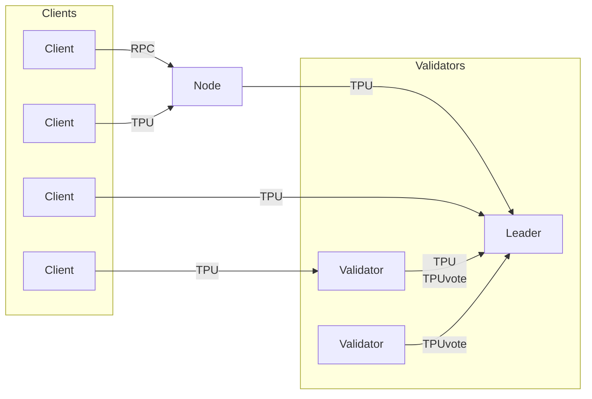

# TPU protocol

TPU is a publicly available peer-to-peer service to queue transactions for inclusion on the Solana blockchain.

It is backed by a streaming protocol (UDP datagrams or QUIC) which routes transactions to network leaders.

## Topology

- **Clients** produce new transactions
- **Relayers** forward transactions to leaders or other relayers
- **Leaders** pack transactions into blocks

The lifecycle of a transaction starts with the signer.
Signers can either submit transactions directly to TPU nodes (requires UDP connectivity) or submit them through RPC servers.



In a Solana cluster, full nodes usually participate as TPU relayers, although not required.
All validators included in the leader schedule should operate an open TPU service.

Nodes attempt to forward transactions to the current leader's TPU endpoints.
The node identities of the leader schedule are well known (runtime intrinsic),
and their TPU endpoints are part of CRDS ContactInfo.

## Classes

The network uses separate classes of TPU traffic for QoS.

- The **TPUvote** class is Tower BFT consensus messages (highest priority).
- The default **TPU** class is regular user transactions, generated by validators.
- The **TPUfwd** class is user transactions that the previous leader did not fully process.

## TPU/QUIC protocol v1

TPU/QUIC relays transactions over the QUIC transport protocol.

QUIC is defined by [RFC 9000] and runs on UDP networks.

Data is encrypted using TLS 1.3, defined by [RFC 8446].

  [RFC 8446]: https://www.rfc-editor.org/rfc/rfc8446.html
  [RFC 9000]: https://www.rfc-editor.org/rfc/rfc9000.html

### Connection Parameters

**Compliance**

The QUIC/TPU protocol does not aim to be fully TLS-compliant ([RFC 8446 Section 9]).

Peers must support the following cipher suites:
- `TLS_AES_128_GCM_SHA256` (0x1301, TLS 1.3)
- `TLS_CHACHA20_POLY1305_SHA256` (0x1303, TLS 1.3)

Peers should not negotiate any deprecated TLS 1.2 cipher suites.

Peers must support the following cryptographic schemes:
- digital signature schemes
  - `ed25519` (0x0807)
- key exchange groups
  - `x25519` (29)

Peers are not required to support any additional cryptographic schemes.
Contrary to [RFC 8446 Section 9.1], the following cryptographic schemes are optional:
- digital signature schemes
  - `rsa_pkcs1_sha256` (0x0401)
  - `ecdsa_secp256r1_sha256` (0x0403)
  - `rsa_pss_rsae_sha256` (0x0804)
- key exchange groups
  - `secp256r1` (23)

Refer to the [IANA TLS Parameters](https://www.iana.org/assignments/tls-parameters/tls-parameters.xhtml) for an authoritative list of identifiers.

  [RFC 8446 Section 9]: https://datatracker.ietf.org/doc/html/rfc8446#section-9
  [RFC 8446 Section 9.1]: https://datatracker.ietf.org/doc/html/rfc8446#section-9.1

**Key Exchange**

Clients must include an X25519 key share in the initial ClientHello message.

Failure to do so may result in an additional handshake round trip or an aborted connection.

**Application-Layer Protocol Negotiation**

The TLS ClientHello and ServerHello messages must include the ALPN protocol ID `solana-tpu`.
The server must reject connections that fail to advertise ALPN accordingly.

**Transport parameters**

On connection creation, peers should set appropriate quotas via the QUIC transport parameters TLS extension.

Recommended server-side parameters:
- `initial_max_stream_data_uni` (0x07): 1232 (Max transaction size)

The following parameters should be omitted (defaulting to 0) or explicitly set to 0:
- `initial_max_data` (0x04), omit on client only
- `initial_max_stream_data_bidi_local` (0x05)
- `initial_max_stream_data_bidi_remote` (0x06)
- `initial_max_streams_bidi` (0x08)

Refer to [RFC 9000 Section 18.2](https://www.rfc-editor.org/rfc/rfc9000.html#name-transport-parameter-definit) for transport parameter definitions.

**Send quota**

In QUIC, senders are only allowed to transmit as much data as specified via quotas by the receiver.
If any quota is violated, the server should close the connection.

The [`MAX_DATA`] and [`MAX_STREAMS`] quotas should be continually replenished by the server side.

  [`MAX_DATA`]: https://www.rfc-editor.org/rfc/rfc9000.html#name-max_data-frames
  [`MAX_STREAMS`]: https://www.rfc-editor.org/rfc/rfc9000.html#name-max_streams-frames

### Streaming Protocol

Transactions are transmitted via client-to-server unidirectional QUIC streams.
Every stream contains exactly one serialized transaction.

TPU/QUIC servers should accept stream data of up to the maximum transaction size (1232 bytes).

#### Single-packet transactions

One or more small transactions can be transmitted in a single QUIC 1-RTT packet.

**Example QUIC frame**

```
STREAM Frame {
  Prefix (5) = 0b00001     # Prefix present on all STREAM frames
  Offset Present (1) = 0   # Offset is absent for first (only) fragment
  Length Present (1)       # Length should be absent if the tx is last in this packet
  Fin (1) = 1              # End-of-stream is set for last (only) fragment

  Stream ID (i)     # Stream ID specified by server (implied length)
  [Length (i)]      # Length of the stream data that follows
  Stream Data (..)  # Contains the transaction
}
```

#### Transaction fragmentation

Fragmentation is required when the size of a transaction exceeds the packet MTU of the underlying UDP/IP layers.

TPU/QUIC implements fragmentation by splitting a QUIC stream across multiple packets.
The payload of each QUIC packet should maximize space up to the MTU.

Peers must avoid sending QUIC traffic using IPv4/IPv6 fragmentation.
Incoming QUIC traffic indicating IP fragmentation may be ignored.

**Example QUIC frames**

_First UDP packet_

```
STREAM Frame {
  Prefix (5) = 0b00001
  Offset Present (1) = 0   # Offset is absent for first fragment
  Length Present (1) = 0   # Length is absent, as fragment frames always fill packet
  Fin (1) = 0

  Stream ID (i)
  Stream Data (..)
}
```

_Second UDP packet_

```
STREAM Frame {
  Prefix (5) = 0b00001
  Offset Present (1) = 1
  Length Present (1) = 0
  Fin (1) = 0

  Stream ID (i)
  [Offset (i)]
  Stream Data (..)
}
```

_Last UDP packet_

```
STREAM Frame {
  Prefix (5) = 0b00001
  Offset Present (1) = 1
  Length Present (1) = 0
  Fin (1) = 1             # Terminate stream

  Stream ID (i)
  [Offset (i)]
  Stream Data (..)
}
```

#### Acknowledgement

`STREAM` frames sent by clients are ack-eliciting.
Refer to [RFC 9000 Section 13.2.1] for obligations on sending `ACK` frames.

It is permitted to coalesce multiple `ACK` frames to reduce packet count.

#### Stream Limits

The server should send [`MAX_STREAM_DATA`] frames for recently created fragmented tx streams.
The client should expect arbitrarily receive quotas for any stream.

Note that stream IDs are incremental (ignoring the two least significant bits).
Upon opening a stream with an out-of-order ID, all preceding streams are also created.

In this case, the server may proactively send multiple [`MAX_STREAM_DATA`] frames for implicitly created streams.

  [RFC 9000 Section 13.2.1]: https://www.rfc-editor.org/rfc/rfc9000.html#name-sending-ack-frames
  [`MAX_STREAM_DATA`]: https://www.rfc-editor.org/rfc/rfc9000.html#name-max_stream_data-frames

#### Aborting

The server must terminate the QUIC connection in case of the following events:

  - Submission of invalid transactions, specifically:
    - Txs that fail deserialization
    - Txs that fail parameter sanitization
    - Txs that fail signature verification
  - Transmission of QUIC datagrams, defined by [RFC 9221]
  - Attempted creation of QUIC bidirectional streams (already forbidden by quota)
  - All other cases where the QUIC RFC dictates connection termination.

  [RFC 9221]: https://www.rfc-editor.org/rfc/rfc9221.html

## TPU/UDP protocol

TPU/UDP is a simple datagram-oriented network protocol.

Each datagram carries a single serialized transaction without headers or padding.

The protocol is strictly unidirectional. The receiver should therefore ignore the source IP address and UDP port.

It is being deprecated in favor of TPU/QUIC, which adds authentication, confidentiality, and congestion control.

TPU/UDP traffic cannot be multiplexed with other protocols over the same destination port.

## Security

### Source IP spoofing

The source address on IP headers is an untrusted field and can be forged by attackers over the Internet.

A practical defense involves challenging the source to prove that it is privileged to see incoming traffic at the supposed address.
For example, TCP or QUIC in 1-RTT mode is protected by a three-way handshake,
wherein the source returns back a pseudorandom nonce it has previously received by the destination.

The TPU/UDP and TPU/QUIC protocols do not protect against source IP spoofing.
Therefore, the receiver must ignore the source IP address when using these protocols.

Critically, the receiver must not send back significantly more traffic back to the supposed source than what originally arrived.
Failure to do so introduces a traffic amplification vulnerability commonly used in DDoS attacks.

For more information, refer to [BCP 38](https://www.rfc-editor.org/info/bcp38).

### Packet flood incentivization

When TPU/UDP links become congested, packets start to get dropped arbitrarily.
This incentivizes clients to repeatedly send packets (spam) to increase the chance
of getting transactions confirmed. Such increase in traffic worsens congestion.

TPU/QUIC implements retransmit and congestion control to address this vulnerability.

### Confidentiality

TPU traffic should be treated as confidential data.

The ideal TPU route consists of a single hop from transaction signer to leader.
Using TPU/QUIC for end-to-end encryption further reduces MitM risks.
